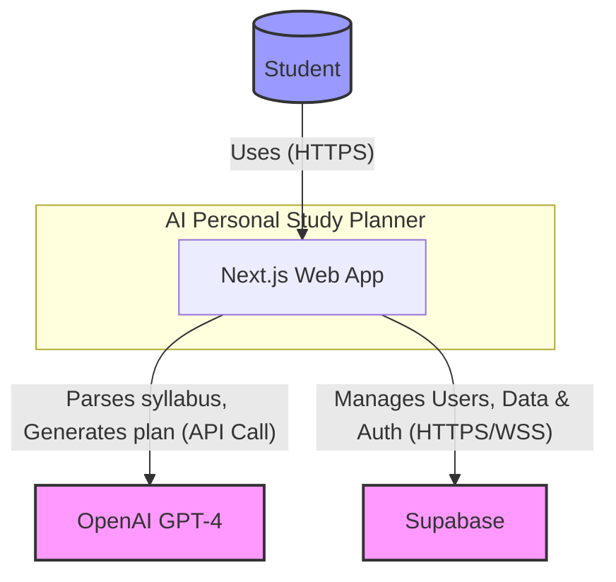
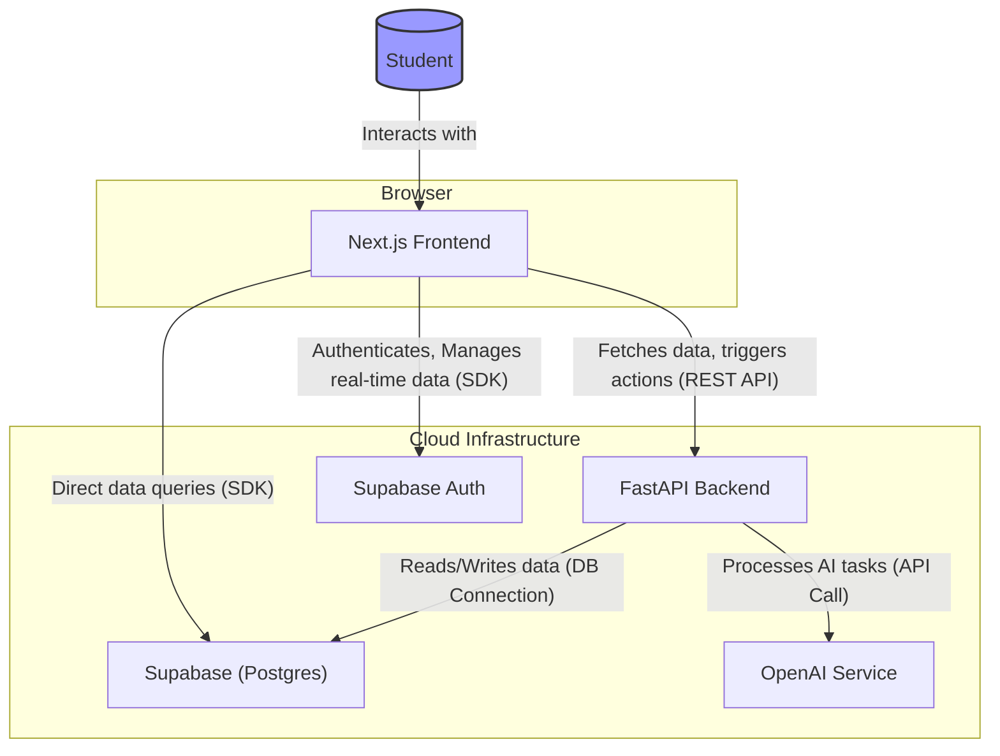

# AI-Powered Personal Study Planner - Solution Architecture

**Author:** Winston, Architect
**Date:** 2025-11-30
**Version:** 1.0

---

## 1. Introduction

This document outlines the solution architecture for the **AI-Powered Personal Study Planner**. The design prioritizes stability, scalability, and developer productivity, adhering to the principle that a clear plan is the foundation of a successful system. We will leverage proven, modern technologies to meet the functional and non-functional requirements laid out in the PRD and UX Design Specification.

The architecture is designed to support the core user journeys: a seamless initial plan generation and an effortless daily-use loop, all while being robust enough to scale and evolve.

---

## 2. System Context Diagram (C4 Level 1)

This diagram shows the overall system landscape, its users, and its key external dependencies.



| Element | Description |
|---|---|
| **Student** | The primary user of the application. They interact with the system via the web application. |
| **Next.js Web App** | The single-page application (SPA) that the user interacts with. It's responsible for the UI, client-side state, and communicating with backend services. |
| **OpenAI GPT-4** | The external AI service used for complex tasks like parsing syllabus content and generating the initial study plan structure. |
| **Supabase** | The backend-as-a-service provider used for database storage (PostgreSQL), user authentication, and real-time data synchronization. |

---

## 3. Component Diagram (C4 Level 2)

This diagram breaks down the "AI Personal Study Planner" into its major logical components.



| Component | Description | Technology | Responsibilities |
|---|---|---|---|
| **Next.js Frontend** | The client-side application running in the user's browser. | Next.js, React, Zustand | Renders the UI, manages client state, handles user interactions, communicates with backend services. |
| **FastAPI Backend** | The server-side application providing business logic. | Python, FastAPI | Exposes a REST API, orchestrates AI-intensive tasks (syllabus parsing), and encapsulates complex business logic. |
| **Supabase (Postgres)** | The primary data store. | PostgreSQL | Persists all user data, including courses, study plans, and progress. Enforces data integrity via RLS. |
| **Supabase Auth** | The authentication service. | Supabase GoTrue | Manages user sign-up, login, password resets, and issues JWTs for secure API access. |
| **OpenAI Service** | The external large language model provider. | OpenAI API | Provides the intelligence for parsing unstructured text and generating structured study plans. |

---

## 4. Data Model (Supabase/PostgreSQL)

The data model is designed to be simple, relational, and secure, with Row Level Security (RLS) enabled on all tables to ensure data privacy.

```sql
-- Enable Row Level Security for all tables
ALTER TABLE users ENABLE ROW LEVEL SECURITY;
ALTER TABLE courses ENABLE ROW LEVEL SECURITY;
ALTER TABLE syllabus_topics ENABLE ROW LEVEL SECURITY;
ALTER TABLE study_sessions ENABLE ROW LEVEL SECURITY;

-- Users Table: Stores user information, linked to Supabase Auth.
CREATE TABLE public.users (
    id UUID PRIMARY KEY REFERENCES auth.users(id) ON DELETE CASCADE,
    full_name TEXT,
    created_at TIMESTAMPTZ DEFAULT NOW()
);

-- Courses Table: Stores information about each course a user adds.
CREATE TABLE public.courses (
    id BIGINT PRIMARY KEY GENERATED ALWAYS AS IDENTITY,
    user_id UUID NOT NULL REFERENCES public.users(id) ON DELETE CASCADE,
    name TEXT NOT NULL,
    exam_date DATE,
    created_at TIMESTAMPTZ DEFAULT NOW()
);

-- Syllabus Topics Table: Stores topics extracted from a course's syllabus.
CREATE TABLE public.syllabus_topics (
    id BIGINT PRIMARY KEY GENERATED ALWAYS AS IDENTITY,
    course_id BIGINT NOT NULL REFERENCES public.courses(id) ON DELETE CASCADE,
    title TEXT NOT NULL,
    description TEXT,
    estimated_hours NUMERIC(4, 2)
);

-- Study Sessions Table: The core of the study plan, representing a single block of study time.
CREATE TABLE public.study_sessions (
    id BIGINT PRIMARY KEY GENERATED ALWAYS AS IDENTITY,
    course_id BIGINT NOT NULL REFERENCES public.courses(id) ON DELETE CASCADE,
    topic_id BIGINT REFERENCES public.syllabus_topics(id) ON DELETE SET NULL,
    user_id UUID NOT NULL REFERENCES public.users(id) ON DELETE CASCADE,
    scheduled_date DATE NOT NULL,
    start_time TIME,
    end_time TIME,
    status TEXT NOT NULL DEFAULT 'Not Started' CHECK (status IN ('Not Started', 'In Progress', 'Completed', 'Missed')),
    created_at TIMESTAMPTZ DEFAULT NOW()
);

-- RLS Policies to ensure users can only access their own data.
CREATE POLICY "Enable read access for own users" ON public.users FOR SELECT USING (auth.uid() = id);
CREATE POLICY "Enable insert for authenticated users" ON public.courses FOR INSERT WITH CHECK (auth.uid() = user_id);
CREATE POLICY "Enable all access for own courses" ON public.courses FOR ALL USING (auth.uid() = user_id);
CREATE POLICY "Enable all access for own topics" ON public.syllabus_topics FOR ALL USING (auth.uid() = (SELECT user_id FROM courses WHERE id = course_id));
CREATE POLICY "Enable all access for own sessions" ON public.study_sessions FOR ALL USING (auth.uid() = user_id);
```

---

## 5. Core Data Flows

### 5.1 Study Plan Generation

This flow is initiated when a user creates a new course and provides a syllabus.

1.  **Frontend (Next.js):** The user submits the course name, exam date, and syllabus text through the "Guided Wizard".
2.  **API Call:** The frontend sends this data to a `/generate-plan` endpoint on the **FastAPI Backend**.
3.  **Backend (FastAPI):**
    a.  Receives the request.
    b.  Constructs a detailed prompt for the **OpenAI Service**, including the syllabus text and instructions to extract key topics.
    c.  Sends the prompt to OpenAI and awaits the structured JSON response containing the list of topics.
4.  **Frontend (Next.js):** The backend returns the parsed topics to the frontend for user confirmation. The user can edit or approve the list.
5.  **API Call:** Upon confirmation, the frontend sends the final topic list and user preferences (e.g., hours/week) back to the backend.
6.  **Backend (FastAPI):**
    a.  Calculates the study schedule, distributing topics between the current date and the exam date based on user preferences.
    b.  Inserts the new course, topics, and all the generated `study_sessions` into the **Supabase Database** in a single transaction.
7.  **Frontend (Next.js):** The dashboard now reflects the new course and its schedule, either through a page refresh or real-time subscription.

### 5.2 Dynamic Rescheduling

This flow is triggered when a user marks a task as 'Missed'.

1.  **Frontend (Next.js):** The user interacts with a `StudyTaskCard` and marks a session as 'Missed'. The frontend updates the status of the specific `study_session` in the **Supabase Database**.
2.  **Trigger:** This action can trigger a backend process, either via a database trigger (e.g., using pg_cron or a webhook) or a direct API call to a `/reschedule` endpoint on the **FastAPI Backend**.
3.  **Backend (FastAPI):**
    a.  Retrieves all 'Not Started' and 'Missed' sessions for the given course from the **Supabase Database**.
    b.  Re-calculates the schedule for these remaining sessions, distributing them over the available future time slots up to the exam date.
    c.  Updates the `scheduled_date` for the affected `study_sessions` in the database.
4.  **Frontend (Next.js):** The UI updates automatically to reflect the new schedule. This is a key benefit of using Supabase's real-time capabilities; the frontend can subscribe to changes in the `study_sessions` table and redraw the calendar dynamically.

---

## 6. Architectural Decisions

-   **Frontend/Backend Separation:** Using a distinct Next.js frontend and FastAPI backend provides a clean separation of concerns. It allows the frontend team to focus on the user experience while the backend team can focus on business logic and AI integration.
-   **Leveraging Supabase:** Using Supabase as a Backend-as-a-Service (BaaS) for the database and authentication is a pragmatic choice. It offloads the complexity of managing a database, user authentication, and real-time infrastructure, which accelerates development significantly. RLS is a powerful feature for enforcing security at the database level.
-   **Centralized AI Logic in Backend:** All interaction with the OpenAI service is routed through the FastAPI backend. This prevents exposing API keys to the client and allows us to create a layer of abstraction; if we ever change the AI provider, we only need to update the backend service.

This architecture is robust, secure, and provides a solid foundation for the MVP and future iterations.
