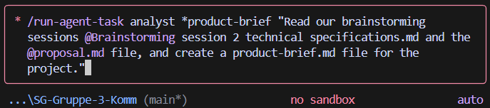
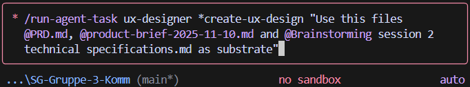
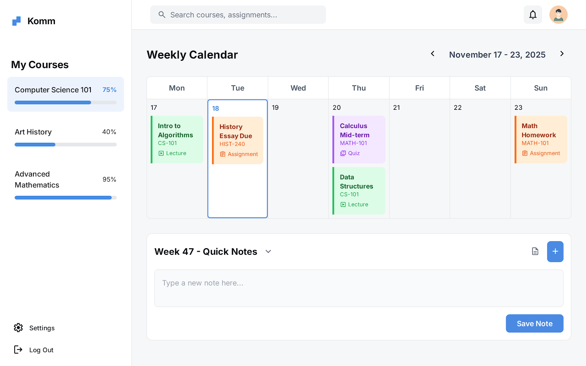

# Refleksjonsrapport - Programmering med KI

## 1. Gruppeinformasjon

**Gruppenavn:** [SG-GRUPPE-3-KOMM]

**Gruppemedlemmer:**
- [Bjørnar Jensen 1] - [241595-ID/Bjornar.jensen@himolde.no]
- [Sten Otto Eilertsen 2] - [160808-ID/sten.o.eilertsen@himolde.no]
- [Tobias André Torbergsen 3] - [241813/E-post]

**Dato:** [DD.MM.ÅÅÅÅ]

---

## 2. Utviklingsprosessen

### 2.1 Oversikt over prosjektet
[Kort beskrivelse av hva dere har utviklet. Hva var hovedmålet med applikasjonen?]

Målet med prosjektet er å utvikle en nettbasert applikasjon som genererer en personlig og adaptiv studieplan. Denne planen baseres på brukerens eksamensdatoer, pensuminnhold, tilgjengelig studietid og fremgang. Systemet vil automatisk fordele emner, planlegge repetisjoner og dynamisk justere planen når brukeren henger etter eller fullfører emner tidlig. Hovedmålgruppen er universitets- og høyskolestudenter som forbereder seg til flere eksamener. Applikasjonen skal redusere stress og kognitiv belastning ved å automatisere planleggingen og fremme konsistent fremgang gjennom datadre  vet personalisering.

### 2.2 Arbeidsmetodikk
[Beskriv hvordan dere organiserte arbeidet]
- Hvordan fordelte dere oppgaver? Vi har jobbet i lag i ukentlige workshops. Vi har hele tiden sørget for at alle har hengt med i arbeidet vi gjør. Vi har rotert om hvem som har delt skjerm og tatt styring over arbeidet mens vi alle har kommunisert sammen om hva som skal gjøres. Alle medlemme i gruppen har satt opp VScode og github (og alt annet som var påkrevd) på sin maskin slik at vi hver for oss har kunnet jobbet individuelt. 
- Hvilke verktøy brukte dere for samarbeid og hvordan det fungerte? (f.eks. Git, og Teams) Vi har brukt Git hub versjonshåndtering og branch. I teams har vi brukt gruppe 
- Hvordan brukte dere KI-verktøy i prosessen? Vi har brukt gemini integrert i VScode. Vi har vært et kritisk øye til LLMen og følgt nøye med på hva den. Vi har også forbedret våre prompts ved å loope promptene vår i LLMen. 

%%%%%%%%%%%%%%%%%%%%%%%%%%%%%%%%%%%%%%%%%%%%%%%%%%%%%%%%%%%%%%%%%%%%%%%%%%%%%%%%%%%%%%%%%%%%%%%%%%%%%%%%%%%%%%%%%%%%%%%%%%%%%%%%%%%%%%%%%%%%%
### 2.3 Teknologi og verktøy
[Liste over de viktigste teknologiene og verktøyene dere brukte]
- Frontend: [f.eks. NextJS, HTML/CSS]
- Backend: [f.eks. Python/FastAPI]
- Database: [f.eks. Supabase, MongoDB, PostgreSQL]
- KI-verktøy: [Gemini-flash, Gemini-pro, ChatGPT,Stich]
- Andre verktøy: [VS Code, BMAD-metodikk]
%%%%%%%%%%%%%%%%%%%%%%%%%%%%%%%%%%%%%%%%%%%%%%%%%%%%%%%%%%%%%%%%%%%%%%%%%%%%%%%%%%%%%%%%%%%%%%%%%%%%%%%%%%%%%%%%%%%%%%%%%%%%%%%%%%%%%%%%%%%%%
### 2.4 Utviklingsfaser
[Beskriv de ulike fasene i utviklingen]

**Fase 0: Planlegging**  
Fase 0 bestod av å etablere et solid fundament for prosjektet gjennom strukturerte KI-drevne arbeidsprosesser. Vi startet med et *workflow-init* steg, der KI genererte en første versjon av `bmm-workflow-status.yaml`. Dette ga oss en tydelig oversikt over hvilke aktiviteter, dokumenter og arbeidsfaser prosjektet ville kreve videre i BMAD-løpet.

Deretter gjennomførte vi flere omfattende *brainstorming sessions* ved hjelp av `/run-agent-task analyst *brainstorm`. Hver brainstorming-økt resulterte i egne markdown-dokumenter som oppsummerte funn, innsikt og mulige løsningsretninger. KI hjalp oss her med å strukturere tankene våre, avdekke problemområder og identifisere funksjonelle muligheter vi ikke nødvendigvis ville kommet på alene.

Vi gjennomførte også en dedikert *research session* ved hjelp av `/run-agent-task analyst *research`, der vi undersøkte tekniske alternativer for hvordan vi burde orchestrate LLM-interactions i prosjektet. Dette ga oss et bedre grunnlag for teknologivalg og videre arkitektur.

Til slutt samlet vi alle innsiktene i et helhetlig *product brief* gjennom `/run-agent-task analyst *product-brief`. KI analyserte brainstorming-dokumentene, research-resultatene og vårt proposal-utkast, og genererte et konsolidert dokument (`product-brief.md`). Dette beskrev prosjektets mål, brukerbehov, funksjonelle krav og videre retning, og fungerte som et viktig referansepunkt for det videre arbeidet i BMAD-prosessen.

Prompt eksempel i planleggingsfasen:

/run-agent-task analyst *product-brief "Read our brainstorming sessions @Brainstorming session 2 technical specifications.md and the @proposal.md file, and create a product-brief.md file for the project"

- [Hvordan brukte dere KI her? Husk å lagre promptene deres! Inkluder ALLE stegene dere gjorde.]

**Fase 1: Requirements and UX Design**  
I fase 1 gikk vi videre fra idé- og informasjonsinnsamling til å konkretisere prosjektets krav og brukeropplevelse. Arbeidet startet med en *Planning*-fase der vi brukte KI til å generere en fullstendig Product Requirements Document (PRD) ved hjelp av `/run-agent-task pm *prd`. Dette dokumentet (PRD.md) beskrev funksjonelle krav, målgrupper, brukerbehov og tekniske rammer som skulle styre resten av utviklingen.

Deretter gjennomførte vi en egen valideringsrunde gjennom `/run-agent-task pm *validate-prd`, som resulterte i en *validation report*. Denne prosessen sikret at PRD-en var konsistent, gjennomførbar og i tråd med prosjektets mål. KI hjalp oss med å avdekke svakheter, uklare krav og manglende sammenhenger, noe som gjorde dokumentet mer robust.

Neste del av fase 1 bestod av å utvikle det visuelle og konseptuelle brukergrensesnittet. Via `/run-agent-task ux-designer *create-ux-design` genererte KI omfattende UX-designmateriale, inkludert:
- `ux-design-specification.md`
- `ux-color-themes.html`
- `ux-design-directions.html`

Disse dokumentene inneholdt både layout-forslag, navigasjonsstrukturer, designretninger og fargepaletter som kunne brukes som grunnlag for frontend-utviklingen senere i prosjektet. KI hjalp oss med å tydeliggjøre hvordan produktet kunne se ut i praksis, og hvilke brukeropplevelser vi burde støtte.

Fasen ble avsluttet med en designvalidering via `/run-agent-task ux-designer *validate-ux-design`, der KI vurderte konsistens, brukervennlighet og samsvar mellom UX-designene og kravene definert i PRD-en. Samlet ga fase 1 oss et klart, dokumentert og verifisert grunnlag for å gå videre til mer teknisk arkitektur og implementering.

Prompt eksempel i designfasen:

/run-agent-task ux-designer *create-ux-design "Use this files @PRD.md, @product-brief-2025-11-10.md and @Brainstorming session 2 technical specifications.md as substrate"  

**Fase 2: Solutioning and Architecture**  
Fase 2 handler om å definere hvordan løsningen faktisk skal bygges, og å omforme krav, innsikt og design fra tidligere faser til en konkret og gjennomførbar systemarkitektur. Dette innebærer å etablere tekniske strukturer, avklare avhengigheter og beskrive hvordan ulike deler av systemet skal fungere sammen.

Et sentralt steg i denne fasen er *Solutioning*, hvor KI eller et arkitektverktøy brukes til å generere et foreslått arkitekturdokument via `/run-agent-task architect *create-architecture`. Dokumentet inneholder typisk systemkomponenter, datamodeller, API-struktur, informasjonsflyt og teknologistack. Målet er å skape et helhetlig bilde av hvordan systemet skal implementeres.

Parallelt brukes prosjektledelsesverktøy til å bryte ned kravene i epics og user stories gjennom `/run-agent-task pm *create-epics-and-stories`. Dette konverterer funksjonelle behov til konkrete utviklingsoppgaver og gjør det tydelig hvilke deler av systemet som skal bygges og i hvilken rekkefølge. Resultatet er et overblikk over arbeidsstrukturen som utviklingen senere skal følge.

Fasen inkluderer også en *test-design*-prosess via `/run-agent-task tea *test-design`, hvor det utarbeides forslag til teststrategi og testscenarier. Dette skaper et rammeverk for hvordan kvalitet skal sikres gjennom utviklingsløpet, før kode faktisk skrives.

Til slutt gjennomføres en *Solutioning Gate Check* via `/run-agent-task architect *solutioning-gate-check`. Denne evalueringen vurderer om arkitekturen, epics og testgrunnlaget er tydelige, konsistente og tilstrekkelige til at utviklingen kan gå videre. Gate-checken fungerer som en kontrollmekanisme for å sikre at prosjektet har et solid fundament før implementasjonen starter.

Fase 2 fungerer dermed som en bro mellom konsept og faktisk utvikling, og etablerer de strukturelle og organisatoriske rammene som gjør det mulig å bygge produktet på en systematisk og skalerbar måte.

**Fase 3: Implementation**  
Fase 3 handler om å omsette arkitektur og krav til faktisk funksjonalitet gjennom et sprint-basert utviklingsløp. Prosessen starter med `/run-agent-task sm *sprint-planning`, hvor KI genererer en sprintplan (`sprint-status.yaml`) som definerer hvilke epics og stories som skal utvikles.

For hver epic opprettes en teknisk spesifikasjon via `/run-agent-task sm create-epic-tech-context`, etterfulgt av en validering. Dette gir et klart teknisk grunnlag før utviklingen starter. Epicene brytes deretter ned i user stories, som gjennomgår en strukturert prosess: story creation, validation, context creation, ready-for-dev–markering og til slutt utvikling.

Under implementasjonen går hver story gjennom flere utviklings- og review-sykluser via `/run-agent-task dev *develop-story` og `/run-agent-task dev *code-review` til koden er godkjent. Deretter markeres storyen som ferdig og testes gjennom `/run-agent-task sm *test-review`.

Når alle stories i en epic er fullført, avsluttes arbeidet med en `/run-agent-task sm *epic-retrospective`.  
Fase 3 fokuserer dermed på praktisk utvikling, kvalitetssikring og kontinuerlig iterasjon gjennom en tydelig definert sprintworkflow.

---

## 3. Utfordringer og løsninger

### 3.1 Tekniske utfordringer

**Utfordring 1: KI-modellen forstod ikke BMAD-rammeverket**  
**Problem:**  
En av de største tekniske utfordringene var at Gemini ofte ikke forstod BMAD-metodikken, selv om vi ga klare instruksjoner. Modellen misforstod fasene, blandet rollene, hoppet over deler av prosessen, eller forsøkte å være “for kreativ” i stedet for å følge strukturen vi hadde lært. Dette gjorde at vi ofte måtte starte samtalen på nytt eller omskrive promptene mange ganger før modellen oppførte seg slik BMAD krever.

**Løsning:**  
Vi måtte bruke mer presise og strengere formulerte prompts, der vi eksplisitt beskrev både rolle, oppgave, metode, forventet output og hva modellen *ikke* skulle gjøre. Etter hvert fant vi en oppskrift som fungerte: tydelige rammer, steg-for-steg-prompting og bruk av flere forklaringer som viste modellen hva vi ønsket at den skulle plukke opp fra BMAD. Det krevde ekstra tid og mange forsøk, men resultatet ble mer stabile og tilpassede svar.

**KI sin rolle:**  
KI var både til hjelp og en utfordring. Når promptene fungerte, produserte KI svært gode og strukturerte leveranser som passet inn i BMAD-prosessen. Men svak kontekstforståelse, manglende rollekontroll og varierende kvalitet gjorde at KI til tider bremset fremdriften. Dette førte til ekstra arbeid for oss, spesielt tidlig i prosjektet.

---

**Utfordring 2: Endringer i BMAD-rammeverket underveis i semesteret**  
**Problem:**  
BMAD-rammeverket som ble presentert i undervisningen ble oppdatert flere ganger underveis. Dette skapte tekniske utfordringer fordi dokumentasjonen, eksemplene og modellenes tidligere kontekst ikke lenger stemte med den nye versjonen. Dermed måtte vi omformulere tidligere arbeid, endre promptstrukturer og på nytt lære KI hvordan den nye versjonen av rammene skulle tolkes.

**Løsning:**  
Vi løste dette ved å være fleksible og kontinuerlig justere prosessen etter hvert som rammeverket ble endret. Faglærer var heldigvis svært løsningsorientert og ga oss oppdaterte forklaringer, nye eksempler og klare rettelser når noe ikke stemte. Vi oppdaterte også våre egne prompts og arbeidsdokumenter slik at KI fikk tydelige instruksjoner basert på den siste versjonen av BMAD.

**KI sin rolle:**  
KI hjalp oss med å raskt omskrive deler av dokumentasjonen og tilpasse strukturen til de nye rammene, men KI ble samtidig forvirret av endringene og måtte stadig "læres opp" på nytt. Dette førte til ekstra arbeid, men ga oss også god trening i prompt engineering og versjonskontroll av kontekst.

### 3.2 Samarbeidsutfordringer

En sentral samarbeidsutfordring var å finne tidspunkt som passet for alle gruppemedlemmene. Vi har sittet geografisk spredt og hatt ulike timeplaner, noe som gjorde koordinering mer krevende. For å håndtere dette har vi brukt direkte kommunikasjon via både Teams og Messenger, noe som gjorde det mulig å avklare ting raskt og holde en effektiv dialog mellom møtene. Denne løsningen fungerte godt, men krevde at alle var fleksible og aktive i kommunikasjonen for å sikre god fremdrift. 

### 3.3 KI-spesifikke utfordringer

Vi opplevde flere utfordringer som var direkte knyttet til bruken av KI-modeller i BMAD-prosessen.

**Utfordring 1: KI mistet kontekst i lange samtaler**  
KI-modellen hadde begrensninger når samtalene ble lange og komplekse. Selv om vi hadde tydelig definert roller, struktur og formål tidligere, kunne modellen miste tråden etter hvert. Dette førte til at KI plutselig endret skrivestil, ignorerte regler eller leverte svar som ikke lenger fulgte BMAD-prosessen. For å håndtere dette måtte vi ofte starte nye økter, repetere instruksjonene og minne modellen på rammeverket vi fulgte.

**Utfordring 2: KI ga selvsikre, men feilaktige svar**  
En annen utfordring var at KI tidvis leverte svært selvsikre svar som inneholdt feil eller misforståelser. Dette gjaldt både i tekniske forklaringer, i BMAD-artefakter og i generert kode. Selv når svarene fremsto overbevisende, måtte vi faktasjekke dem grundig. Dette medførte ekstra arbeid, spesielt i situasjoner der vi først antok at KI hadde gitt korrekt informasjon. Erfaringen viste at vi alltid måtte verifisere KI-utdata før de kunne brukes videre i prosjektet.

**Utfordring 3: Vansker med å få KI til å generere riktige BMAD-menyer og struktur**  
En gjennomgående utfordring var å få KI til å produsere de riktige menyene og strukturelle elementene som BMAD-metodikken krever. Selv når vi ba om spesifikke lister eller standardiserte seksjoner, leverte KI ofte enten feil struktur, manglende punkter eller en helt annen stil enn forventet.

Ved å formulere prompts som indirekte ledet modellen mot denne strukturen, kunne vi i praksis “manipulere” KI til å forstå hva vi ønsket og til slutt levere mer korrekte BMAD-menyer. Dette krevde presise instrukser og flere iterasjoner, men ga etter hvert mer treffsikre resultater. 
---

## 4. Kritisk vurdering av KI sin påvirkning

### 4.1 Fordeler med KI-assistanse

**Effektivitet og produktivitet:**  
Bruken av KI gjorde det mulig å arbeide langt raskere enn vi kunne gjort manuelt. KI guidet oss også gjennom malene og prosessene i BMAD-metodikken, noe som gjorde det enklere å forstå strukturen og vite hva som skulle produseres i hver fase. I tillegg hjalp KI oss med å generere kodeutkast, f.eks med Stich mock-up av dashboard, forklare funksjoner og foreslå forbedringer, noe som gjorde utviklingsarbeidet mer effektivt. Oppgaver som vanligvis ville krevd lang research ble redusert til minutter.

**Læring og forståelse:**  
KI bidro også til økt faglig forståelse. Når vi sto fast i tekniske eller metodiske spørsmål, kunne KI gi forklaringer og eksempler som hjalp oss videre. KI fungerte på mange måter som en ekstra veileder som ga raske svar og alternative perspektiver.

**Kvalitet på koden:** - KOMMER TILBAKE TIL SENERE
- [Hvordan påvirket KI kodekvaliteten?]
- [Eksempler på forbedringer KI foreslo]

### 4.2 Begrensninger og ulemper
[Reflekter over de negative aspektene]

**Kvalitet og pålitelighet:**  
Selv om KI var et nyttig verktøy, opplevde vi at kvaliteten på svarene varierte betydelig. KI kunne gi selvsikre, men feilaktige eller mangelfulle forklaringer, og misforstod av og til oppgaven slik at den enten forenklet innholdet for mye eller fokuserte på detaljer som ikke var relevante. Dette førte til at vi måtte dobbeltsjekke og justere mange av dokumentene og kodene som ble generert.

I enkelte tilfeller opplevde vi også at KI “gjorde seg vrang”, spesielt når den ikke tolket prompten slik vi forventet. Den kunne da gi irrelevante svar, ignorere instruksjoner eller foreslå løsninger som ikke hadde sammenheng med det vi jobbet med. KI hadde også en tendens til å hallusinere konsepter eller foreslå teknologier som ikke var en del av prosjektet. 

På grunn av disse feilene opplevde vi flere ganger at det ikke var hensiktsmessig å fortsette i samme samtaletråd. I slike situasjoner måtte vi starte hele seksjoner på nytt fordi KI hadde blandet så mye kontekst at videre arbeid ville ført til enda flere misforståelser.

Vi erfarte at kvaliteten og påliteligheten økte betydelig når promptene var svært presise og detaljerte. Likevel krevde dette ekstra arbeid fra vår side, og gjorde at vi aldri kunne bruke KI-utdata direkte uten manuell gjennomgang og kvalitetssikring.

**Avhengighet og forståelse:**  
Bruken av KI gjorde mange oppgaver enklere, og vi merket at det til tider var lett å bli for avhengige av verktøyet. Når KI alltid var tilgjengelig og kunne levere raske svar, ble det fristende å spørre modellen før vi forsøkte å løse utfordringene selv. Dette kunne redusere den naturlige refleksjonen og problemløsningen vi normalt ville gjort manuelt.

KI leverte også ofte gode og overbevisende forklaringer, noe som kunne gi en falsk følelse av forståelse. Det var lett å godta et svar som “riktig nok” uten at vi nødvendigvis hadde jobbet oss gjennom resonnementet bak. Samtidig opplevde vi at den manuelle kvalitetssikringen vi måtte gjøre på KI sine svar bidro til at vi likevel lærte mye. Ved å analysere, rette og forbedre KI-utdata utviklet vi både metodisk forståelse og teknisk innsikt, noe som balanserte risikoen for å bli for avhengige av KI.

**Kreativitet og problemløsning:**  
KI påvirket kreativiteten vår ved at den ofte styrte retningen i stedet for at vi selv utviklet ideene fra starten. Når KI foreslo løsninger eller strukturer, var det lett å ta dette som utgangspunkt i stedet for å utforske egne alternativer. Dette gjorde at vår kreative prosess i noen tilfeller ble mer reaktiv enn initiativbasert.

Vi merket også at KI kunne skape et slags «tunnelsyn». Når modellen foreslo en bestemt måte å løse en oppgave på, ble det naturlig å følge denne linjen videre, selv om andre muligheter kunne vært mer kreative eller interessante. Selv om KI gjorde arbeidet mer effektivt, opplevde vi at det av og til begrenset den frie, utforskende problemløsningen som vanligvis oppstår når man jobber uten forhåndsbestemte forslag.

### 4.3 Sammenligning: Med og uten KI

Arbeidet med prosjektet ville vært betydelig annerledes uten KI. Uten tilgang til KI-verktøy ville flere av oppgavene i BMAD-prosessen tatt mye lengre tid, spesielt der vi måtte utforme dokumenter, foreslå strukturer eller utvikle brukerhistorier. KI fungerte som en rask sparringspartner som kunne generere førsteutkast og hjelpe oss videre når vi sto fast. Uten denne støtten ville vi måttet løse alt manuelt, noe som ville krevd mer research, flere diskusjoner og mer tid til iterasjon.

De mest krevende delene uten KI ville sannsynligvis vært å etablere en tydelig struktur i BMAD-fasene og å produsere tekniske beskrivelser og krav på en konsistent måte. Samtidig kunne enkelte deler av prosjektet vært lettere, fordi vi ikke ville trengt å håndtere KI-relaterte utfordringer som feil svar, tapt kontekst eller misforståelser. Arbeidsflyten ville vært mer forutsigbar, men også mye tregere.

Alt i alt vurderer vi at sluttresultatet sannsynligvis ville vært dårligere uten KI. KI gjorde det mulig å arbeide mer effektivt og levere mer omfattende dokumenter enn vi ville klart innenfor tidsrammen alene. Samtidig ville vi lært mer på egen hånd uten KI, men på bekostning av fremdrift og kvalitet. Kombinasjonen av menneskelig vurdering og KI-støtte ga etter vår vurdering et bedre sluttprodukt enn begge deler hver for seg.

### 4.4 Samlet vurdering

Totalt sett vurderer vi at KI hadde en klart positiv effekt på prosjektet. Selv om vi opplevde utfordringer knyttet til kvalitet, kontekst og konsistens, bidro KI i stor grad til at vi kunne jobbe raskere, holde strukturen i BMAD-prosessen og produsere mer omfattende dokumenter enn vi ellers ville klart. KI fungerte som en støtte i både planlegging, dokumentasjon og utvikling, og gjorde det lettere å iterere og forbedre innholdet underveis.

Samtidig var det avgjørende at vi ikke stolte blindt på KI. Den viktigste lærdommen var at KI er mest effektiv når den brukes som et samarbeidsverktøy og ikke som en fasit. Kvalitetssikring, manuell gjennomgang og egen refleksjon var nødvendige for å sikre at resultatet ble korrekt og relevant. Vi erfarte også at gode prompts og tydelige rammer hadde stor betydning for hvor nyttige svarene ble.

Samlet sett var KI en netto positiv faktor som forbedret både arbeidsflyt og sluttresultat, men prosjektet viste også viktigheten av å kombinere KI-støtte med menneskelig vurdering og kritisk tenkning.

---

## 5. Etiske implikasjoner

### 5.1 Ansvar og eierskap

Selv om KI bidro i utviklingen, er det fortsatt vi som studenter som har det fulle ansvaret for koden og dokumentene som inngår i prosjektet. KI fungerer som et støtteverktøy, men den kan ikke holdes ansvarlig for kvalitet, riktighet eller konsekvenser av løsningene den foreslår. Det innebærer at vi må forstå, kvalitetssikre og teste alt KI genererer før det tas inn i prosjektet. Å bruke KI fritar oss ikke for faglig ansvar, men krever tvert imot at vi har nok innsikt til å vurdere om løsningene faktisk er gode og korrekte.

For å sikre kvalitet i KI-generert kode må man alltid gjennomføre manuell gjennomgang, testing og eventuell refaktorering. KI kan skrive kode som ser riktig ut, men som inneholder skjulte feil, mangler eller uforståelige løsninger. Dette gjør kvalitetssikring til en viktig del av arbeidsprosessen, spesielt når KI bidrar med større kodebolker eller tekniske forslag.

Når det gjelder opphavsrett og intellektuell eiendom, er koden i prosjektet vårt å regne som studentprodusert arbeid selv om KI har generert deler av den. KI har ikke juridiske rettigheter til innholdet den produserer, og institusjoner behandler resultatet som arbeid levert av gruppen. Likevel bør man være oppmerksom på at KI kan generere løsninger som ligner eksisterende kode fra åpne databaser eller tidligere treningsdata. Derfor er det viktig å sikre at det som inkluderes i prosjektet ikke bryter med lisenskrav eller inneholder sensitiv informasjon.

### 5.2 Transparens

Det bør være full transparens rundt bruken av KI i et utviklingsprosjekt, spesielt i en akademisk sammenheng. Åpenhet om KI-bruk gjør det mulig for sensor og andre lesere å forstå hvordan arbeidet er utført, og hvilke deler som er generert med støtte fra eksterne verktøy. Dette er viktig for å sikre akademisk integritet og for å vise at vi som gruppe forstår materialet og har gjort selvstendige vurderinger.

Dokumentasjonen av KI sitt bidrag kan gjøres ved å beskrive hvilke deler av prosessen KI ble brukt til, hvilke typer oppgaver som ble løst med KI-støtte, og hvordan svarene ble kvalitetssikret og bearbeidet av oss. Det er også relevant å forklare hvilke begrensninger vi støtte på, og hvordan vi håndterte feil eller misforståelser som KI introduserte. 

Manglende transparens kan føre til flere utfordringer. For det første kan det skape tvil om hvem som faktisk står bak arbeidet, og om vi har tilstrekkelig forståelse til å forsvare løsningene våre. For det andre kan det undergrave troverdigheten til prosjektet dersom det oppdages at KI har vært brukt uten åpenhet. Til slutt kan manglende KI-dokumentasjon gi inntrykk av at vi forsøker å ta æren for arbeid som ikke er vårt eget. Derfor er åpenhet ikke bare riktig, men også nødvendig for å sikre en rettferdig og faglig korrekt evaluering.

### 5.3 Påvirkning på læring og kompetanse

Bruken av KI påvirker læring og kompetanse på både positive og utfordrende måter. KI bidrar til rask fremdrift og gjør det mulig å produsere dokumenter, kode og analyser på kort tid. Dette kan være en fordel i prosjekter med stramme tidsfrister, men det kan også skape en risiko for at man blir for avhengig av verktøyet. Dersom man bruker KI som første løsning fremfor som støtte, kan det redusere den dyptgående læringen som normalt oppstår gjennom å utforske problemer på egen hånd.

En slik avhengighet kan føre til at enkelte ferdigheter ikke utvikles fullt ut. Eksempler på dette er evnen til å skrive strukturert dokumentasjon fra bunnen av, kritisk problemløsning, detaljert koding uten hjelp, og evnen til å gjennomføre tekniske analyser uten forhåndsgenererte forslag. I tillegg kan man miste noe av forståelsen for hvorfor ting fungerer, dersom KI alltid leverer ferdige svar i stedet for å la oss jobbe oss frem til innsikten selv.

For å opprettholde en god balanse mellom effektivitet og læring må KI brukes som et supplement, ikke som en erstatning. Vi erfarte at den beste utviklingen kom når vi kombinerte KI-støtte med egen vurdering, manuell kvalitetssikring og en bevisst refleksjon over prosessen. På den måten fikk vi både utnyttet effektiviteten KI gir, og samtidig utviklet kompetanse som er nødvendig for videre studier og fremtidig arbeidsliv.

### 5.4 Arbeidsmarkedet

Utbredt bruk av KI vil ha stor påvirkning på fremtidige jobber innen IT og teknologi. Mange oppgaver som tidligere krevde manuell koding, dokumentasjon eller analyse kan nå automatiseres eller støttes av KI-verktøy. Dette betyr at enkelte tradisjonelle roller kan få mindre fokus, spesielt de som handler om repetitivt arbeid eller standardiserte oppgaver. Samtidig vil det skapes nye behov for kompetanse innen KI-integrasjon, systemforståelse, datasikkerhet og evnen til å kvalitetssikre KI-generert innhold.

Roller som systemarkitekter, KI-eksperter, sikkerhetsspesialister og tekniske prosjektledere vil sannsynligvis bli viktigere, fordi disse krever helhetsforståelse, kritisk tenkning og evne til å kombinere menneskelig vurdering med KI-støtte. På den andre siden kan rene junior- eller kodeproduksjonsroller få mindre betydning, ettersom KI allerede kan generere funksjonell kode på kort tid. Fremtidens arbeid vil i større grad handle om å forstå og kontrollere systemene enn å skrive all koden selv.

For vår egen fremtidige karriere ser vi at det blir avgjørende å kunne bruke KI effektivt, samtidig som vi utvikler en solid faglig plattform som KI ikke kan erstatte. Jobber i en KI-drevet verden vil kreve både teknisk innsikt, kritisk vurderingsevne og forståelse for hvordan KI bør styres og kvalitetssikres. Det viktigste vil være å bruke KI som et verktøy, ikke en krykke, og å bygge kompetanse som gjør oss i stand til å kombinere automatisering med menneskelig ekspertise.

### 5.5 Datasikkerhet og personvern
- Hvilke data delte dere med KI-verktøy?
- Potensielle risikoer ved å dele kode og data med KI
- Hvordan skal man tenke på sikkerhet når man bruker KI?

### 5.5 Datasikkerhet og personvern

I prosjektet vårt delte vi i hovedsak tekniske beskrivelser, kodeutkast og BMAD-relaterte dokumenter med KI-verktøyene. Vi unngikk bevisst å legge inn sensitiv informasjon, personopplysninger eller data som kunne kobles til enkeltpersoner. Dette var viktig fordi KI-modeller lagrer og analyserer innhold midlertidig, og det er ikke alltid full oversikt over hvordan data brukes internt i systemene.

Det eksisterer reelle risikoer knyttet til å dele kode og prosjektdata med KI. For eksempel kan man utilsiktet dele proprietær informasjon, eller KI kan generere forslag basert på materiale den har sett i treningsdata som er lisensbelagt eller ikke ment for videre bruk. Det er også risiko for at KI kan “lekke” mønstre fra innhold andre brukere har skrevet, selv om dette normalt er redusert i moderne modeller.

For å tenke riktig om sikkerhet bør man alltid behandle KI som en ekstern tjeneste: del kun det som er nødvendig, unngå sensitive data, og sørg for at alt innhold som sendes til KI er noe man komfortabelt kunne vist offentlig. I tillegg bør man kvalitetssikre all KI-generert kode for å unngå at det introduseres sikkerhetshull eller utrygge løsninger. En bevisst og kritisk tilnærming er nødvendig for å balansere effektiv KI-bruk med ansvarlig håndtering av data.

---

## 6. Teknologiske implikasjoner

### 6.1 Kodekvalitet og vedlikehold

KI-generert kode kan være effektiv i starten av et prosjekt, men den skaper også utfordringer for langsiktig vedlikehold. Selv om KI ofte produserer kode som fungerer, er den ikke alltid skrevet med tanke på struktur, lesbarhet eller beste praksis. Dette kan gjøre det vanskeligere å forstå og videreutvikle koden i etterkant. KI genererer gjerne løsninger som er logiske for modellen, men som ikke nødvendigvis følger et konsistent mønster som er lett for mennesker å jobbe videre med.

%%%%%%%%%%%%%%%%%%%%%%%%%%%%%%%%%%%%%%%
Når det gjelder forståelighet, opplevde vi at KI-kode noen ganger var godt strukturert, men like ofte var den enten for kompakt, unødvendig kompleks eller manglet forklarende kommentarer. Dette kan føre til ekstra arbeid for utviklere som senere skal lese og bruke koden. Det blir derfor viktig å manuelt rydde opp, kommentere og gjøre koden mer pedagogisk før man tar den videre i prosjektet.

Debugging av KI-generert kode kan også være utfordrende. KI kan lage kode som ser korrekt ut, men som skjuler små logiske feil eller avvik fra kravene. Dette gjør det vanskelig å identifisere hva som faktisk gikk galt, siden modellen ikke alltid følger menneskelig tankegang i utformingen. Man kan derfor bruke mer tid på å feilsøke og forstå hva KI har forsøkt å gjøre, enn om man hadde skrevet koden selv. Erfaringen vår var at KI er et godt verktøy for å produsere utkast, men at kvalitet og vedlikehold krever grundig manuell oppfølging.
%%%%%%%%%%%%%%%%%%%%%%%%%%%%%%%%%%%%%%

%%%%%%%%%%%%%%%%%%%%%%%%%%%%%%%%%%%%%%
### 6.2 Standarder og beste praksis

KI følger ikke alltid beste praksis eller etablerte industristandarder. Selv om modellen ofte foreslår løsninger som fungerer teknisk, kan koden være unødvendig komplisert, mindre sikker eller basert på rammeverk og mønstre som ikke lenger er anbefalt. Dette skyldes at KI-modeller trener på store mengder historisk data, som også inneholder utdaterte eller suboptimale eksempler.

I prosjektet opplevde vi flere situasjoner der KI foreslo løsninger som var mindre hensiktsmessige, der den ikke følgte BMAD rammetverket som forventet. Noen ganger genererte KI også kode som ikke harmonerte med moderne praksis innenfor rammeverkene vi jobbet med. Selv om dette ga oss et utgangspunkt, krevde det ofte at vi manuelt måtte redesigne eller forenkle løsningen.

Dette viser viktigheten av å validere alle KI-forslag før de tas inn i prosjektet. KI er et sterkt støtteverktøy, men det krever at vi som utviklere har nok forståelse til å vurdere hva som faktisk er riktig og framtidsrettet. Å gjennomgå forslag kritisk, sammenligne med oppdaterte kilder og kvalitetssikre valgene våre er avgjørende for å sikre at prosjektet holder god teknisk standard.

%%%%%%%%%%%%%%%%%%%%%%%%%%%%%%%%%%%%%%

### 6.3 Fremtidig utvikling

Vi tror KI vil få en stadig større rolle i programvareutvikling fremover. Mange av oppgavene som tidligere krevde mye tid, som dokumentasjon, generering av kodeutkast, testing og feilsøking, kan delvis automatiseres eller støttes av KI. Utviklere vil i større grad fungere som arkitekter og kvalitetskontrollører, der de styrer prosessen, vurderer løsninger og sørger for at programmene følger krav og standarder. KI vil ikke erstatte utviklere, men den vil endre måten vi jobber på og hvilke oppgaver som forventes utført manuelt.

Dette betyr at nye ferdigheter blir viktigere for utviklere. Kritisk tenkning, systemforståelse og evnen til å evaluere KI-generert innhold vil være sentralt. I tillegg blir samarbeid mellom mennesker og KI en kjernedel av kompetansen i fremtiden, der prompt engineering og evnen til å definere gode instruksjoner blir en naturlig del av verktøykassen. Samtidig vil klassiske ferdigheter som feilsøking, sikkerhet og arkitektur være viktige for å sikre kvalitet og robusthet i løsninger KI bidrar til.

Basert på våre erfaringer anbefaler vi at KI brukes bevisst og strukturert i utviklingsprosesser. Den bør fungere som et supplement som sparer tid og gir forslag, men aldri som en erstatning for egen vurdering eller faglig forståelse. Alle KI-forslag bør kvalitetssikres, forbedres og tilpasses av mennesker. Med riktig bruk kan KI gi betydelig verdi, men det krever at man forblir aktiv, kritisk og ansvarlig gjennom hele utviklingsarbeidet.

---

## 7. Konklusjon og læring

### 7.1 Viktigste lærdommer

1. **Bruk av KI som utviklingsverktøy:**  
   Vi lærte hvordan KI kan brukes effektivt som støtte i både planlegging, dokumentasjon og koding. Prosjektet ga oss god erfaring i å formulere presise prompts, styre KI i riktig retning og bruke den som et samarbeidspartner i utviklingsprosessen.

2. **Forståelse av utviklingsprosessen:**  
   Vi fikk bedre innsikt i hvordan en strukturert utviklingsprosess fungerer, spesielt gjennom bruken av BMAD-metodikken. Dette gjorde oss mer bevisste på sammenhengen mellom behov, mål, arkitektur og implementasjon.

3. **Forståelse av begrensningene til KI**  
   Vi lærte at KI ikke alltid leverer korrekte eller relevante svar, og at det derfor er nødvendig å forstå modellens begrensninger. Dette ga oss bedre innsikt i når vi kan stole på KI og når vi må være ekstra kritiske.

4. **Viktigheten av overordnet faglig forståelse:**  
   Prosjektet viste at man ikke trenger å kunne alle tekniske detaljer i dybden for å jobbe effektivt, så lenge man har en god overordnet forståelse. Ved å forstå prinsippene, strukturen og målene i prosjektet, kunne vi bruke KI til å fylle inn detaljer uten å miste kontrollen over helheten.

5. **Bedre samarbeid gjennom tydelig kommunikasjon:**  
   Prosjektet viste hvor viktig det er med tydelig og jevnlig kommunikasjon i teamet, spesielt når vi jobber digitalt og asynkront. Klare forventninger, statusoppdateringer og aktiv bruk av Teams og Messenger gjorde at vi kunne koordinere bedre og unngå misforståelser.

%%%%%%%%%%%%%%%%%%%%%%%%%%%%%%%%%%%%%%%%%%%%%%
### 7.2 Hva ville dere gjort annerledes?

Når det gjelder bruken av KI, ville vi vært mer bevisste fra starten på hvordan vi formulerte prompts og hvordan vi skulle styre modellen. Vi erfarte etter hvert at kvaliteten på KI-svarene var sterkt avhengig av hvor presise og konkrete instruksjonene våre var. Ved å etablere tydeligere retningslinjer for KI-bruken tidligere, kunne vi unngått flere av feilene som førte til at vi måtte starte deler av BMAD-prosessen på nytt.

I samarbeid og organisering ville vi satt opp en mer strukturert plan for kommunikasjon, rollefordeling og oppfølging. Selv om samarbeidet fungerte godt, kunne vi ha hatt nytte av hyppigere og mer formelle statusmøter, samt en tydeligere arbeidsfordeling. Dette kunne gjort fremdriften enda jevnere og redusert behovet for avklaringer underveis.

Alt i alt ville disse endringene gitt en mer effektiv prosess og et enda bedre sluttresultat, samtidig som vi kunne jobbet mer systematisk og forutsigbart gjennom hele prosjektet.
%%%%%%%%%%%%%%%%%%%%%%%%%%%%%%%%%%%%%%%%%%%%%%%%%%%%

### 7.3 Anbefalinger

Vår hovedanbefaling til andre studenter som skal bruke KI i utviklingsprosjekter, er å være tydelige og presise i måten dere gir instrukser på. God prompt­skriving er avgjørende for å få nyttige og konsistente svar. Start gjerne med å bruke KI til å lage utkast, ideer og struktur, men sørg for å revidere og kvalitetssikre alt innhold før det tas i bruk. KI fungerer best når det brukes som en støtte, ikke som en fasit.

En viktig fallgruve å unngå er å bli for avhengig av KI. Det kan være fristende å la modellen løse alt, men dette kan hemme læringen og føre til at man mister oversikt over hva som faktisk skjer i prosjektet. I tillegg kan KI gi feil svar, misforstå oppgaven eller gå i en helt annen retning enn forventet. Når dette skjer, er det ofte bedre å starte en ny samtale i stedet for å fortsette en tråd som allerede har gått seg fast.

Som beste praksis anbefaler vi å lagre gode prompts underveis, jobbe med korte og avgrensede spørsmål, og alltid kombinere KI-forslag med egen faglig vurdering samt å ofte "Commmite" i GitHub og ofte bruk av "git pull". KI kan gi stor verdi i utviklingsprosjekter, så lenge man bruker det bevisst, kritisk og strukturert.

### 7.4 Personlig refleksjon (individuelt)

**[Navn på gruppemedlem 1]:**
[Personlig refleksjon over egen læring og utvikling]

**[Navn på gruppemedlem 2]:**
[Personlig refleksjon over egen læring og utvikling]

**[Navn på gruppemedlem 3]:**
[Personlig refleksjon over egen læring og utvikling]

---

## 8. Vedlegg (valgfritt)

Skjermbilder av applikasjonen. Mockup laget i Stich:

Ferdig prompt for å generere skjermbildet produsert av prompt i Gemini: [Stich_prompt_for_Mockup_Generation.md](Fase-1/Stich_prompt_for_Mockup_Generation.md)

Prompt for Mockup Generation: Student Learning Dashboard
1. Project Overview
Application Name: "Komm" (Student Collaboration Platform) Purpose: A modern, intuitive platform for university students to manage their learning, track progress, and collaborate. This mockup focuses on the central student dashboard.

2. User Persona
User: Alex, a 20-year-old university student.
Goals: Stay organized, keep track of all assignments and lectures for different courses, understand their progress at a glance, and never miss a deadline.
Pain Points: Juggling multiple courses with different schedules is confusing. It's hard to visualize the week's workload and see how much progress has been made in each course without checking multiple different systems.
3. Mockup Request: The Student Dashboard
Create a mockup for the main dashboard page a student sees after logging in. The design should be clean, modern, and user-friendly.

Core User Journey: Weekly Planning and Progress Check
Alex logs in to see their schedule for the upcoming week and check their overall progress in their courses.

4. Key Components & Features
A. Main Header

Left Side: Application Logo and Name ("Komm").
Right Side: A search bar, a notifications icon (bell), and a user profile avatar.
B. Main Content Area: The Weekly Calendar

Layout: A prominent 7-day calendar view (Monday to Sunday). The current day should be visually highlighted (e.g., with a different background color or a border).
Navigation: Simple "Previous Week" and "Next Week" arrow buttons. The current date range should be displayed (e.g., "November 17 - 23, 2025").
Learning Activities:
These are cards placed on the calendar days.
Each card represents a learning activity (e.g., lecture, assignment, quiz, lab session).
Card Content:
Activity Title (e.g., "Calculus Mid-term Quiz", "History Essay Due")
Course Name (e.g., "MATH-101", "HIST-240")
Activity Type (indicated by a small icon and/or color code):
Lecture: Use a "play" or "screen" icon.
Assignment: Use a "document" or "pencil" icon.
Quiz/Exam: Use a "checkmark" or "star" icon.
Example: On Wednesday, there might be a blue card for a "History Essay Due" and a green card for a "Calculus Lecture".
C. Left Sidebar: Courses and Progress

Title: "My Courses".
Layout: A vertical list of all courses the student is enrolled in.
For each course in the list, display:
Course Title: (e.g., "Computer Science 101", "Art History", "Advanced Mathematics").
Progress Bar: A clearly visible progress bar showing the completion percentage for that course (e.g., 75%). The percentage should be displayed on or near the bar.
The currently selected course could be highlighted.
5. Visual Design & Style
Aesthetic: Clean, minimalist, and modern. Use whitespace effectively to avoid a cluttered look.
Color Palette:
Primary: A professional and calm blue (e.g., #4A90E2).
Background: A light, neutral color (e.g., off-white #F8F9FA or a very light grey).
Accent Colors: Use a few distinct, harmonious colors for the different activity types on the calendar (e.g., a soft green for lectures, a gentle orange for assignments, a stronger red/purple for exams).
Typography: Use a clean, sans-serif font like Inter, Lato, or Roboto for readability. Establish a clear type hierarchy (e.g., larger font for headers, smaller for details).
Icons: Use simple, universally understood line icons.
Summary of Mockup Scene:
Create a single, comprehensive screen showing the student dashboard. The calendar should be populated with a few example learning activities across the week. The "My Courses" sidebar should list 3-4 courses with different progress percentages. The overall impression should be that of a well-organized and empowering tool for a busy student.

Lenke til GitHub repository:
https://github.com/IBE160/SG-Gruppe-3-Komm

- Annen relevant dokumentasjon

---

**Ordantall:** [Ca. antall ord]

**Forventet lengde:** 3000-5000 ord (avhengig av gruppestørrelse og prosjektets kompleksitet)